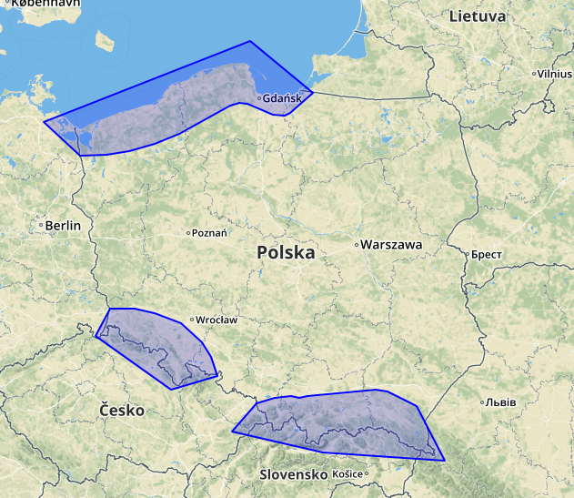

# polska_strefy_wiatrowe_shp
Przybliżony shp dla stref obciążenia wiatrem w Polsce mniej więcej odpowiadający PN-EN 1991-1-4/NA:2010-09

Zawarte są (z nawiązką strefy 2 i 3). Jeżeli coś jest w Polsce i nie łapie się wewnątrz tych stref to jest w strefie 1.

Podkład  [Open Street Map](https://www.openstreetmap.org/)
